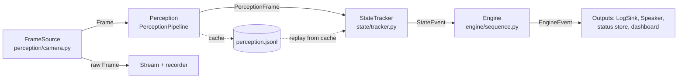

# Implementation Plan — SIH 26174 On-board Experiment Monitor

**How to use this document.** `context.md` says *why*. `essential-features.md` is the **implementation spec** for every must-build feature (**F\<n\>** = Feature n there); `non-essential-features.md` lists what is deferred or excluded. `contracts.py` is the executable contract: every shape, vocabulary and function signature that crosses a person's directory. `DATA_COLLECTION.md` is the crew's standalone recording guide. **This document says who builds what, in what order, how the behavior between the shapes works, how it is tested, and how it merges.** An agent session takes one work packet from Part 10, reads its feature(s) in `essential-features.md` and its types in `contracts.py`, and implements. This document does not repeat reasoning owned by `context.md` or shapes owned by `contracts.py`.

**Team.** Two developers — **P1 (Perception & Data)** and **P2 (State, Engine & App)** — plus four support teammates, the **crew**: two **Data crew** (recording, label checks) and two **Comms crew** (PPT, demo video). There is no separate lead; contract changes are two-person decisions (Part 6).

**Sessions, not days.** Part 10 is a numbered sequence of sessions per person. Each names a prerequisite that must be *visible on `develop`*. Gates (Part 9) have a `Target` column to fill in once the real deadline date is fixed.

---

# Part 1 — Governing Rules

These override anything else here if they conflict.

**R1 — Shapes are code.** `contracts.py` is the single source of truth for shapes, vocabularies and signatures at a person boundary. This plan explains *behavior* around them and never repeats them. Tunable numbers are disclosed judgment-call defaults in the `*Config` models, tuned by a named session — never invented or hard-coded elsewhere.

**R2 — Reuse before you build.** No algorithm is re-implemented if a maintained library provides it; `essential-features.md` names the library per feature.

**R3 — One owner per directory (Part 4).** Nobody edits another person's directory. Importing and calling an exposed function is allowed; editing it or re-implementing it inline is not. Sanctioned calls: P2's runtime and harness call P1's `open_source`, `PerceptionPipeline` and cache reader; P1's recorder, validator and dataset code read `config/experiment.json` through `contracts.ExperimentDefinition`; **P1's validator calls P2's `engine.reference.derive_expected_deviations` once it exists** (before P2.2 lands it warns instead).

**R4 — `contracts.py` is frozen at G0.** After that it changes only by contract PR (Part 6). Agents never edit it.

**R5 — Test first; done means tested.** A feature is done when its Part 7.4 row passes, not when code exists. The golden tests never regress, and this is enforced by git hooks (Part 7.6), not only by this text.

**R6 — Stub your own output first, and merge it into `develop` in the same session.** A stub that lives on an unmerged branch blocks the other person as surely as no stub.

**R7 — Locked stack.** A new dependency needs the other person's agreement, a license check, and an `ISSUES.md` entry. Only P2 edits the lockfile.

**R8 — Derived artifacts are regenerated, never hand-edited:** feature status, perception caches, reports, `model_stamp`, `runs/manifest.csv`, and `RunScript.expected_deviations`.

**R9 — Nothing merges into `develop` without a green `python scripts/check.py` and one review by the other person.** The reviewer merges. Merging happens at every session close (Part 8), never batched at the end of a track.

**R10 — Offline is a property, not an aspiration.** Runtime code makes no outbound network call and downloads nothing; tests block outbound sockets (Part 7.3).

---

# Part 2 — Team & Roles

| Person | Owns | Features | Depends on |
|---|---|---|---|
| **P1** | `perception/` (camera, detector, hands/pose, pipeline, cache, recorder), `training/`, `weights/` | F1, F2, F3, F14 | Crew recordings (F14); P2's harness to consume caches |
| **P2** | `state/`, `engine/`, `outputs/`, `runtime/`, `server/`, `harness/`, `scripts/`, `config/`, lockfile, `reports/` | F4–F13 | P1's `PerceptionFrame` stream (P2 builds its own fakes, Part 10) |
| **Data crew (2)** | `runs/` recordings and `script.json`, `data/label_review.csv`, `data/corrections/`, the props and the rig | — | P1's recorder; P1's label report |
| **Comms crew (2)** | PPT, demo video | — | P2's `reports/` numbers; a working demo (G5) |

**Load, disclosed rather than pretended away.** P2 owns more features but each is deterministic, camera-free and testable from day one, so P2's first five sessions never wait on anyone. P1 owns fewer features but carries the risk: camera, data, the feasibility spike, training and CPU speed. P1's work is the critical path. **If P1 is behind at G3, P2 takes over, in this order:** (1) `training/benchmark_cpu.py`, (2) the review-sheet tool for the crew, (3) the perception-cache build runs. All three have defined inputs and outputs. P2 never takes model code.

**Crew interface.** Everything the crew needs is in `DATA_COLLECTION.md` and `runs/run_plan.csv` (77 planned runs: 36 train / 14 val / 27 test). Each recorded run is `runs/<run_id>/video.mp4` + `script.json` (`RunScript`). The performer's declaration of `performed_steps` **is** the ground truth (no per-frame labeling). `camera_setup_id` changes whenever the rig is touched. **P1 is the crew's contact for recording and review; P2 for PPT numbers.**

---

# Part 3 — Tech Stack, Environments, Setup

## 3.1 The locked stack (complete)

Exact versions are pinned by **P2 from the lockfile in G0**; none is invented here. "Where" = `run` (demo laptop, offline), `train` (GPU box), `tools` (dev-time only, never on the demo machine), `dev`.

| Role | Package / tool | License | Where | Notes |
|---|---|---|---|---|
| Language | Python 3.11 | — | all | Same minor version on both machines |
| Dependencies | `uv` + one lockfile, dependency groups `run` / `train` / `tools` / `dev` | — | all | No Node: the GUI is static vanilla JS |
| Contracts | `pydantic` v2, `numpy`, `pyyaml` | permissive | run | `contracts.py` imports only pydantic + numpy + stdlib (test-enforced); `pyyaml` is needed for `from_yaml` |
| Detector | `rfdetr` (RF-DETR-**Nano**, 384², ~30 M params) | Apache-2.0 | train (+run unless ONNX wins) | Decision at P1.5 (`ISSUES.md`) |
| Detector, CPU alt. | `onnxruntime` | MIT | run | Only if the benchmark picks it; then `rfdetr`/`torch` become `train`-only |
| Detector fallback | YOLO11n via `ultralytics` | **AGPL-3.0** | run only if forced | License decision logged |
| Auto-labeling | YOLO-World (via `ultralytics`) **or** Grounding DINO (`transformers`) | AGPL-3.0 / Apache-2.0 | **tools** | Offline; outputs are data. P1.2 chooses. Verify licenses (R7) |
| Hands + pose | `mediapipe` **Tasks API**, vendored `.task` files | Apache-2.0 | run | `hand_landmarker.task`, `pose_landmarker_lite.task` in `weights/` |
| Video | `opencv-python` | Apache-2.0 | all | |
| Sequence distance | `rapidfuzz` (`DamerauLevenshtein` on id lists) | MIT | run | Verified to accept token lists |
| TTS | `pyttsx3` in a worker process (+ `pypiwin32` on Windows; `espeak-ng` on Linux) | MPL-2.0 (wrapper); OS voices | run | See 3.3 |
| Server | `flask`; `cryptography` for the self-signed cert | BSD / Apache-2.0 | run | MJPEG, Basic auth, HTTPS |
| GUI | Static HTML/CSS/JS, CSS vendored, **no CDN, no framework** | — | run | Offline requirement |
| Tests / lint | `pytest` (markers `F1`..`F14`, `gold_symbolic`, `gold_video`, `slow`), `ruff` | permissive | dev | |
| Training glue | `supervision` (a dependency of `rfdetr`), `Pillow` | permissive | train | |

## 3.2 The four compute environments

| Environment | Where | Runs | Internet |
|---|---|---|---|
| **Dev laptop** (P1, P2) | each laptop, Python 3.11 + `uv` | all code, tests, the runtime, benchmarks, cache builds | at install time only |
| **Training** | a GPU: Colab or Kaggle notebook (or any GPU box) | dataset upload → auto-label (optional, faster) → **fine-tune** (F14 stage 6) → weights download | yes (dev-time) |
| **Recording rig** | the crew's table (`DATA_COLLECTION.md` §2) | `python -m perception.record` | no |
| **Demo / runtime** | the demo laptop, `run` dependency group only | the live system | **none** |

**Why a separate training environment.** The problem statement's "CPU laptop only" constraint is about *deployment*. Fine-tuning a transformer detector is not a CPU job, and RF-DETR's own training guidance is written for GPU (T4/A100). Artifact flow: recordings → shared drive → dev laptop; `data/dataset.zip` → Drive → Colab; `weights/detector.pth` → back into the repo, with `weights/MANIFEST.json`. **If no GPU is reachable at all**, the fallback is a YOLO11n fine-tune on CPU (slow, AGPL) — a decision to make at P1.5, logged in `ISSUES.md`.

## 3.3 TTS voice decision

Tier 1 is **`pyttsx3` using the operating system's own voice** — offline, nothing to download or vendor, and the cues are short phrases where intelligibility beats naturalness. It runs in a separate worker process (Plan 5.5). The maintained neural alternative Piper (`piper1-gpl`) is **GPL-3.0** (the original MIT repository is archived); Kokoro-82M is Apache-2.0 and CPU-real-time per its packagers. Either can *pre-render* the closed set of phrases as WAV files later (Tier 2, `non-essential-features.md`). Reasoning and evidence: `context.md`, "Voice output (TTS)".

## 3.4 Setup and cross-platform rules

```
uv sync --group dev                      # runtime + dev dependencies from the lockfile (each laptop)
uv sync --group tools                    # only on the machine that runs auto-labeling
uv run python scripts/check.py --quick   # must be green before any feature code
```

The team's laptop OS is **not fixed** (`ISSUES.md`), so **every tool is a Python entry point** (`python -m ...`, `python scripts/x.py`), never a bare shell script. Git hooks call `python scripts/check.py`. **Acceptance gate before any feature code** (part of G0): on both machines, install from the lockfile, run `check.py --quick` green on an empty suite, run the **audio self-test** (speak a sentence) and the **camera check** (`open_source("0")` returns a frame).

---

# Part 4 — Repository Structure (Directory Ownership)

```
sih26174/
├── contracts.py                    [BOTH — contract PRs only; frozen at G0]
├── config/
│   ├── experiment.json             [BOTH — shared data; DRAFT until G2; a change follows the contract process]
│   ├── perception.yaml             [P2 — PerceptionConfig, tuned in P2.6]
│   ├── runtime.yaml                [P2 — RuntimeConfig]
│   └── acceptance.yaml             [P1 writes in P1.5; P2 amends in P2.6 — the one shared-config exception]
├── perception/                     [P1 — camera.py, hands.py, detector.py, pipeline.py, cache.py, record.py]
├── training/                       [P1 — sample_frames.py, autolabel.py, prompts.yaml, review_sheet.py, build_dataset.py,
│                                         label_editor/ (dev-time static page + overlay writer; proposed owner: a Comms-crew teammate, P1 reviews),
│                                         finetune.py, eval_detector.py, benchmark_cpu.py, spikes/]
├── weights/                        [P1 — model files git-ignored; MANIFEST.json (sha256 + model_stamp) committed]
├── state/                          [P2 — tracker.py]
├── engine/                         [P2 — sequence.py, reference.py]
├── outputs/                        [P2 — tts.py, logger.py]
├── runtime/                        [P2 — loop.py, recorder.py]
├── server/                         [P2 — app.py, static/ (vendored, no CDN)]
├── harness/                        [P2 — fakes.py, replay.py, report generation]
├── scripts/                        [P2 — check.py, install_hooks.py, dev.py, demo.py, gen_cert.py, replay.py]
├── runs/                           [Data crew + P1 — run_plan.csv, manifest.csv (derived), <run_id>/script.json tracked; video files git-ignored]
├── data/                           [git-ignored — frames, labels, review sheets, dataset, perception caches, label_review.csv, corrections/]
├── runs_out/                       [git-ignored — runtime logs and recorded video]
├── fixtures/                       [add-only — fixture experiment, scripted runs, tiny synthetic clips]
├── reports/                        [P2 generates; P1's stage reports land here too — they feed the PPT]
├── tests/unit/{contracts,perception,training,state,engine,outputs,runtime,server,harness}/   [by owner]
├── tests/integration/              [add-only — nobody edits an existing file]
├── pyproject.toml, uv.lock, .gitignore, .gitattributes, .env.example   [P2]
├── ISSUES.md                       [append-only, union merge — Part 11]
└── AGENTS.md, CLAUDE.md, IMPLEMENTATION_PLAN.md, context.md, essential-features.md, non-essential-features.md, DATA_COLLECTION.md   [root; both, by ack]
```

`contracts.py` is a single module. Do **not** create a `contracts/` package: it would shadow the module silently.

---

# Part 5 — Data Contracts and the Behavior Around Them

## 5.1 Where the contract lives, and the data flow

`contracts.py` defines the shapes; nothing in this plan restates them. If this document and the code disagree, **the code wins and this document has a bug** — fix it in the same commit.



P1 owns everything up to `PerceptionFrame`. It is *pure evidence* with no experiment logic, so P1 is independent of experiment revisions. P2 owns everything after it. The cache lets P2 test the real decision logic on real perception output without running any model.

## 5.2 On-disk layout

- `runs/<run_id>/video.mp4` + `script.json` (`RunScript`) — the crew's recordings. `runs/run_plan.csv` is the plan; `runs/manifest.csv` is derived.
- `data/cache/<run_id>/perception.jsonl` — line 1 is a `PerceptionCacheHeader`, each later line a `PerceptionFrame`. Valid only while its `model_stamp` equals the replaying `Perception.model_stamp`; any model change means rebuilding caches. **Caches are built at `RuntimeConfig.target_fps`** so replay matches live (Plan 5.6, essential-features §0).
- `runs_out/logs/<run_id>.jsonl` (`LogEntry` lines) and `runs_out/video/<run_id>.avi` — runtime output.
- `model_stamp` = `"rfdetr-nano:<sha256[:8]>|hand:<sha256[:8]>|pose:<sha256[:8]>"`. The sha256 is therefore computed anyway; *verifying it at load* stays Tier 2 (`non-essential-features.md`).

## 5.3 StateTracker semantics (P2, `state/tracker.py` — pure logic, no models, no clock)

1. **Per frame:** drop detections with `conf < detector_conf_floor` ("unknown", never acted on). "Best" detection per label is the highest-confidence one (ties: first in list).
2. A step's **truth** is the AND of its `when` rules, evaluated with the semantics written in `contracts.py` section 3.
3. **Lifecycle per step**, counted in *received `PerceptionFrame`s* (not wall time, not `frame_id` gaps):
   - After `reset()`, the first `baseline_frames` frames are baseline. No events are emitted, and any step already true is **latched**.
   - A step is *armed* unless latched or already fired. A latched or fired step re-arms after `release_frames` consecutive false frames.
   - An armed step whose truth holds for `hysteresis_frames` consecutive frames emits **one** `StateEvent` (`t` = that frame's `t`) and disarms.
4. **Event fields:** `confidence` = the minimum over the hysteresis window of the `conf` of the best detections the step's rules reference, plus the `score` of the touching hand for `hand_touching`. `uncertain = confidence < confirm_conf`. `evidence` is diagnostic only.
5. **Same-frame ties** emit in canonical experiment order.
6. **Consequences pinned by tests** (each **verified by simulation** on a reference implementation and a synthetic world): (a) a one-frame glitch never fires; (b) a step already true at the start of a run is **latched and cannot fire until its rule has gone false and re-armed** — in the simulation a first step with a true-at-start rule fired *fifth* — so *every step of `config/experiment.json` must be able to go false before its turn* (Sample Transfer's two stow steps start true and are released when the boxes leave the outer box); an **experiment lint** enforces it against recorded runs once caches exist (P2.6) — wording revised 2026-09-28, see `ISSUES.md`; (c) `absent` rules follow the same latching; (d) **the processing rate matters**: the sample experiment fired 7/7 steps at 15, 10 and 6 fps but only 5/7 at 4 fps, because the dwell that hysteresis needs grows as fps falls.

## 5.4 Engine decision table (P2, `engine/sequence.py`; `SequenceEngine(experiment, RuntimeConfig)`)

Statuses: `pending → confirmed | skipped | completed_late`. *Expected* = the first pending step in canonical order. For each `StateEvent` with step `o`, while the run is `running`:

| Case | EngineEvent(s) | Status change | `speak` |
|---|---|---|---|
| `o` pending and `o` = expected | `step_confirmed` | `o` → confirmed | next step's `say`, if `narrate_next_step` and one exists |
| `o` pending and later than expected | `deviation_detected` **omission**; `skipped_step_ids` = pending steps before `o`, canonical order | those → skipped; `o` → confirmed | `Step skipped: <display names, comma-joined>` |
| `o` skipped (performed late) | `deviation_detected` **out_of_order** | `o` → completed_late | `Out of order: <display name>` |
| `o` confirmed or completed_late | `deviation_detected` **repeat** | none | `Repeated: <display name>` if `alert_on_repeat`, else `None` |
| `o` is the last canonical step, newly confirmed | plus `run_completed` (with `RunSummary`) | run → completed | `Experiment complete` if `all_steps_done`, else `Experiment ended with skipped steps` |
| `finish(t)` while running | `run_completed(aborted=True)` | run → completed | `Run ended early` |
| before `start()` / after completion | ignored, `[]` | — | — |
| unknown `step_id` | raise `ContractViolation` | — | — |

Common to all rows: `confidence_tag = flagged_uncertain` iff `StateEvent.uncertain` — it labels the event but changes no logic. `expected_step_id` is the first pending step *before* the event, `next_step_id` the first pending *after*. There is one `EngineEvent` per `StateEvent`, plus `run_completed` when applicable. `RunSummary.pos` uses Damerau-Levenshtein over the canonical ids vs every step id processed while running (repeats included); `all_steps_done` means no step skipped or pending.

**Disclosed consequences** (found by prototyping this table on the real contract types; they follow from the contract, not from an arbitrary choice):
- **Swapping the *last* pair** reports the late step as `skipped`, not `out_of_order`: the run completes when the last step is first seen, and events after completion are ignored. The swap golden therefore uses a mid-sequence pair. (The run plan includes one such run, `swap-c`, so this behavior is measured, not hidden.)
- A swap yields **two** alerts: an omission at the first step seen, then `out_of_order` at the late arrival. That is intended — the problem statement wants an alert for a skipped step *and* for an out-of-sequence step.

## 5.5 Outputs (P2, `outputs/`)

**Log (`JsonlLogger(path, wall_clock=...)`).** One line per event, never per frame; append, `flush` and `os.fsync` per line; never rewrite. `seq` starts at 0 and strictly increases per run (the router owns the counter; the logger asserts it). **`t_wall` is stamped by the logger** from the injected `wall_clock`, timezone-aware — the only wall-clock read in the system. Because `LogEntry` requires `t_wall` at construction, the router builds entries with the placeholder `datetime(1970, 1, 1, tzinfo=timezone.utc)` and the logger overwrites it (`ISSUES.md` proposes making the field optional at G0). `t_video` is the event's `t`. Runtime-authored entries: `run_started`, `feed_lost` (`detail` = reason), `feed_restored`. Engine-derived entries take a fixed `detail` one-liner *independent of narration settings*: `Confirmed: <display name>`; the same text as the `speak` templates for deviations; and the run-completion phrases from 5.4.

**TTS (`TTSWorker`, a separate process).** `say()` never blocks and never raises. Priority `alert` clears the queue and interrupts the current utterance by terminating the worker and starting a fresh warm one; `info` is queued. Identical `alert` text inside `alert_cooldown_s` is not re-spoken. With no audio device the worker degrades to a silent no-op with one logged warning. Unit tests use `FakeSpeaker` (records `(text, priority)` in order); a single integration test uses a stub backend. Details: `essential-features.md` §7.

## 5.6 Runtime and HTTP (P2, `runtime/`, `server/`)

- **Loop and threading:** as in `essential-features.md` §0 — a capture thread feeding a **latest-frame-wins** store, one inference thread, read-only web handlers. The raw frame goes to the store (`/video_feed` serves the **raw camera feed**) and to the recorder (F11).
- **Processing rate:** the loop is throttled to `target_fps`; `hysteresis_frames` is tuned at that rate; the pipeline must sustain `min_pipeline_fps` (5.8).
- **Feed loss:** `read()` returning `None` with `exhausted=False` is transient. No frame for `feed_timeout_s` writes one `feed_lost` entry; resumed frames write `feed_restored`. A perception exception skips that frame and is logged.
- **Speaking:** deviation events → priority `alert`; everything else → `info`. At run start the runtime speaks the first step's `say` (if `narrate_next_step`) and writes `run_started`.
- **Run control:** `POST /api/run/start` moves `idle → running`. `POST /api/run/reset` finishes the current run (writing `run_completed(aborted=True)` if it was running) and arms a fresh `idle` run with a new `run_id`.
- **Security:** every route in `API_ROUTES` requires Basic auth (`STREAM_USER` / `STREAM_PASSWORD` from a git-ignored `.env`; `.env.example` committed) **and** a client IP in `allowed_client_ips`. TLS is used when `tls_cert`/`tls_key` are set; **without TLS the server binds 127.0.0.1 regardless of `host`**. Credentials never appear in URLs or logs. A test asserts the Flask URL map equals `API_ROUTES`, so the routes cannot drift from the contract.
- **Status:** `/api/status` is built from `engine.snapshot()`. `recent_alerts` is newest-last, capped at **20** (judgment call). The dashboard polls every **500 ms** (judgment call) and loads no external resource.

## 5.7 The dataset pipeline at a glance

The implementation detail for every stage is in `essential-features.md` §14; the crew's view is `DATA_COLLECTION.md` §9. This table is the order, the owners and the gates.

| # | Stage | Command | Owner | Output | Gate |
|---|---|---|---|---|---|
| 0 | Record | `python -m perception.record --plan runs/run_plan.csv` | Data crew (tool: P1) | `runs/<id>/video.mp4`, `script.json` | pilot (plan rows 1–12) → **P1.2 → G2** → the rest |
| 1 | Validate | `python -m perception.record --validate runs/` | Data crew | `runs/manifest.csv` | all flagged runs fixed or re-recorded |
| 2 | Sample frames | `python -m training.sample_frames` | P1 | `data/frames/` | counts in `reports/dataset.json` |
| 3 | Auto-label | `python -m training.autolabel` | P1 | `data/labels/` | area, hue and static-object checks |
| 4 | Review | `python -m training.review_sheet` (also `--static`) + `data/label_review.csv` | Data crew | `reports/dataset.json` | **≤ 10 % `bad` per class**, else fix and re-review a fresh sample; every run's static boxes `ok` or fixed. Run on the pilot frames at P1.2 |
| 4b | Correct | `python -m training.review_sheet --edit --split <s> [--gold N]` (static HTML page: `training/label_editor/`) | Data crew (tool: proposed C5) | `data/corrections/<split>.json` | static boxes fixed; **gold subset** of `val` and `test` verified; `test` corrected without seeing detector output |
| 5 | Build dataset | `python -m training.build_dataset` (applies `data/corrections/`) | P1 | `data/dataset/{train,valid,test}` | no run in two splits; overlay assertions pass |
| 6 | Train (GPU) | `python -m training.finetune` | P1 | checkpoint → `weights/detector.pth`, `MANIFEST.json` | early stopping on val mAP |
| 7 | Evaluate | `python -m training.eval_detector` | P1 | `reports/detector_eval.json` | thresholds in `acceptance.yaml`, checked on the **gold subset** (also reported on all frames) |
| 8 | CPU benchmark | `python -m training.benchmark_cpu` | P1 | `reports/benchmark_cpu.json` | picks detector and `target_fps` |
| 9 | Cache | `python -m perception.cache build` | P1 | `data/cache/<id>/perception.jsonl` | at `target_fps`, all splits |
| 10 | Tune | `python scripts/replay.py --tune` | P2 | `config/perception.yaml`, `reports/tuning.json` | **`val` only** |
| 11 | Test | `python scripts/replay.py --from-cache … --split test` | P2 | `reports/replay_test.json` | once per model version |

## 5.8 Auxiliary file formats (the small seams that are not in `contracts.py`)

These are read by one person and written by another, so their fields are pinned here. `ISSUES.md` proposes turning `acceptance.yaml` and the report shapes into Pydantic models at G0; until then this table is the spec.

**`config/acceptance.yaml`** — starting **judgment calls, not evidence-derived**, written *before* looking at `test` results and amended at most once (P2.6) with both people's ack.

```yaml
detector:   { min_recall_per_class: 0.85, min_map50: 0.80 }   # on hand-verified (gold) test frames, at detector_conf_floor
pipeline:   { min_pipeline_fps: 8 }                            # end-to-end on the demo laptop
replay:     { exact_deviation_match: true, max_mismatched_runs: 0 }
label_review: { max_bad_fraction_per_class: 0.10 }
```

**`weights/MANIFEST.json`** — `detector`: `name`, `file`, `sha256`, `classes` (ordered, = `experiment.classes`), `resolution`, `dataset_stamp`, `trained_at`; `hand` and `pose`: `file`, `sha256`; plus the composed `model_stamp`.

**`runs/manifest.csv`** (derived) — `run_id, split, script_type, fps, frames, duration_s, width, height, operator, camera_setup_id, video_sha256`.

**`data/label_review.csv`** — `run_id, frame_id, class, verdict (ok|bad), reason (wrong_box|missing|duplicate|wrong_class)`.

**`data/corrections/<split>.json`** (added 2026-09-28; written by the label editor, applied by `build_dataset`; the auto-labels are never edited) — `{ "version": 1, "split": "train|val|test", "static_overrides": { "<run_id>": { "<static_class>": [x1, y1, x2, y2] } }, "frames": { "<run_id>_<frame_id>.jpg": { "excluded": false, "verified": true, "boxes": [ { "class": "red_box", "xyxy": [x1, y1, x2, y2] } ] } } }`. Boxes are original-resolution pixels. A `frames` entry **replaces** that frame's boxes wholesale (no per-box merge); `excluded: true` drops the frame; `verified: true` marks a gold frame (a confirmed, unchanged frame still gets an entry); `static_overrides` replace the named static-class box on **every** frame of the run unless that frame has its own entry. Classes must be in `experiment.classes`. This is a proposed shape: P1 may refine it through an `ISSUES.md` entry before P1.4.

**`reports/*.json`** (each carries `generated_at`, the `model_stamp` where relevant, and the inputs' stamps): `dataset.json` (counts per split/class/run, review outcome), `detector_eval.json` (per-class precision/recall, mAP on val and test), `benchmark_cpu.json` (per model: mean and p95 latency, fps, threads, CPU model), `tuning.json` (grid, chosen config, val metrics), `replay_test.json` (per run: pass/fail, expected vs observed deviations, POS; aggregate counts).

## 5.9 Command surface

| Command | Owner | Purpose |
|---|---|---|
| `python scripts/check.py [--quick \| --status \| --video]` | P2 | quick = ruff + contract purity + `gold_symbolic` + offline guard; default = full unit; `--status` = feature table derived from markers; `--video` = cached-replay goldens |
| `python scripts/install_hooks.py` | P2 | installs the git hooks (they call `check.py`) |
| `python scripts/dev.py` | P2 | run the live system with the webcam |
| `python scripts/demo.py` | P2 | the rehearsed demo configuration |
| `python scripts/gen_cert.py` | P2 | self-signed TLS cert |
| `python scripts/replay.py --from-cache \| --video \| --script` | P2 | replay a run through tracker + engine → `ReplayResult` |
| `python -m engine.reference --write runs/` | P2 | fill `expected_deviations` (derived) |
| `python -m perception.record …`, `python -m perception.cache build` | P1 | recording, validation, caches |
| `python -m training.<stage>` | P1 | the dataset/training stages in 5.7 |

---

# Part 6 — Contract-Change Process

**An agent that finds a gap never guesses and never edits `contracts.py`.** `contracts.py`'s own header names `CONTRACT_CHANGES.md`; read that as **`ISSUES.md`** (typed `CONTRACT` entries). Fix that docstring in the G0 contract PR.

1. Append a `CONTRACT` entry to `ISSUES.md`: what is missing, why it matters, a proposed fix.
2. Keep working against a clearly prefixed `TEMP_<n>` local stub. Do not wait.
3. A **human** reads open `CONTRACT` entries at the start of each session. If both agree, either opens a `contract/<slug>` PR touching `contracts.py` (plus its tests and any dependent doc line), the other approves and merges in the same working block, then both rebase and consumers swap `TEMP_` stubs (a mechanical rename).
4. **Additive** changes (a new optional field with a default) may be approved asynchronously. **Breaking** changes (rename, remove, re-type, a changed rule semantic, or any `config/experiment.json` change that alters what goldens expect) need both people in one sitting, and require regenerating goldens and perception caches.
5. `config/experiment.json` follows the same process, because changing a step or a rule changes what the video goldens expect.

---

# Part 7 — Testing Strategy

## 7.1 The rule
Tests are written before or alongside implementation. A feature is not done because code exists; it is done when its 7.4 row passes.

## 7.2 The golden family
Symbolic goldens run against a fixed four-step **fixture experiment** (`fixtures/experiment_4step.json`), never against `config/experiment.json`, so revising the real experiment never changes what the engine goldens expect. Video goldens run against the real experiment via cached perception.

| ID | Performed steps (s1..s4) | Must produce |
|---|---|---|
| **GOLD-1 — the golden test** | `s1, s3, s4` (s2 skipped) | Exactly one `deviation_detected` **omission**, `skipped_step_ids=[s2]`, `speak == "Step skipped: <s2 display name>"`; `FakeSpeaker` receives exactly that utterance once, priority `alert`; one matching `LogEntry`; run completes with `all_steps_done=False`, POS 0.75. This is the problem statement's own requirement (skipped step → voice alert + timestamped log line). **It must never regress.** |
| GOLD-2 | `s1, s3, s2, s4` (mid swap) | omission at `s3`, then `out_of_order` for `s2`; two alerts, in that order; `late_ids=[s2]`; POS 0.75 |
| GOLD-3 | `s1, s2, s3, s4` | zero deviations; POS 1.0; spoken sequence = next-step phrases then `Experiment complete` |
| GOLD-4 | `s1, s2, s2, s3, s4` | one `repeat` at the second `s2`; alert only if `alert_on_repeat` |
| GOLD-5 | *nothing performed (idle)* | zero `StateEvent`s, zero alerts, only `run_started` in the log |

(GOLD-1..4 expected values were produced by running the reference decision table on the real contract types.) Video goldens replay every `test`-split run from its cache and compare observed deviations (type, step ids, order) with `RunScript.expected_deviations`. Strict equality is the default; any relaxation is written in `config/acceptance.yaml` with both people's ack in `ISSUES.md`, never silently.

## 7.3 Invariants (each has its own test)
- **Time arrives on the data.** No wall-clock or monotonic read in `perception/` (except `camera.py`, which stamps `Frame.t`), `state/` or `engine/` (a lint test greps for it).
- **Determinism.** Same `PerceptionFrame`s → same `StateEvent`s → same `EngineEvent`s; fixed seeds wherever randomness exists.
- **Contract purity.** `import contracts` succeeds in an environment without torch, mediapipe or rfdetr.
- **Offline.** An autouse pytest fixture blocks non-loopback outbound sockets in every test.
- **Split hygiene.** Splits are per **run**, never per frame (adjacent frames are near-duplicates). The dataset builder asserts no run is in two splits, and nothing is tuned on `test`.
- **Ground-truth integrity.** Every `script.json`'s `expected_deviations` equals the reference engine's derivation; a mismatch fails the contract test, so a mislabeled clip cannot corrupt the golden set.
- **Experiment lint.** Every `step_id` is snake_case and unique, every rule class is in `classes` (contract), every `say` is ≤ 8 words, and (once caches exist) **every step whose `when` is true during the baseline window of a recorded run must go false for at least `release_frames` consecutive frames before that step's turn in every `correct` run** (a step that is never true at baseline passes trivially; revised 2026-09-28, see `ISSUES.md`).
- **Routes.** The Flask URL map equals `API_ROUTES`.

## 7.4 Definition of done, per feature
Acceptance thresholds live in `config/acceptance.yaml` (5.8). They are starting judgment calls. Before they exist, the test asserts the metric is *computed and recorded*.

| F | Owner | Done when (all must pass) |
|---|---|---|
| **F1** Ingestion | P1 | `open_source` opens a camera index string, a file, or a URL; a bad source raises `SourceError` at construction; `frame_id` strictly increases and `t` follows the contract (file: `frame_id/fps`); `read()` returning `None` follows the `exhausted` semantics; `DecimatedSource` keeps original ids; the measured-fps fallback works when the driver reports 0; tested on a generated clip |
| **F2** Detector | P1 | Labels ⊆ `experiment.classes`; the id ↔ name mapping is asserted against `MANIFEST.json` at load; deterministic for fixed weights; per-class recall on `test` meets `acceptance.yaml`; CPU fps recorded; loads local weights only; RGB conversion tested |
| **F3** Hands/pose | P1 | Landmarks in original **pixels** (never normalized); `[]` when no hand, never an error; 21 hand / 33 pose landmarks; timestamps strictly increasing across `reset()`; `.task` files load from `weights/` offline; tested on recorded frames |
| **F4** Interaction | P2 | All five rule kinds match the `contracts.py` semantics via table-driven tests: best detection, grown box, missing container, `absent` |
| **F5** Sequence engine | P2 | Every row of the 5.4 table; GOLD-1..5; determinism; POS values as pinned; `engine.reference` derives `expected_deviations` and the contract test passes |
| **F6** Skip / out-of-order | P2 | Each deviation type has a test; the Damerau-Levenshtein property test (essential-features §6) |
| **F7** Voice alerts | P2 | `Speaker` never blocks or raises; `alert` pre-empts; cooldown; `FakeSpeaker` order pinned; works with no network and no audio device; the audio self-test passes on each dev machine |
| **F8** Next-step | P2 | `speak` text pinned by the goldens; the runtime speaks the first step at run start; `narrate_next_step=False` silences it |
| **F9** Log | P2 | One line per event, never per frame; `seq` from 0 and asserted; `t_wall` tz-aware and stamped by the logger; `detail` one-liners pinned; the last complete line parses after a mid-run kill |
| **F10** Stream | P2 | `/video_feed` serves the raw feed at `stream_fps`; every route needs Basic auth **and** an allowed IP; no credential in any URL or log; URL map == `API_ROUTES`; no-TLS ⇒ loopback bind |
| **F11** Local storage | P2 | One playable file per run in `video_dir`, named by `run_id`; a truncated file still plays; a recorder failure is logged and does not stop the run |
| **F12** GUI | P2 | Renders `StatusResponse`; polls; run start/reset work; a test scans the HTML/CSS/JS for non-local `http(s)://` resources; a browser check confirms it |
| **F13** Reliability | P2 | Floor, confirm, hysteresis, release and baseline tests; a one-frame glitch never fires; `uncertain` flag correct; the idle video golden yields zero events; the experiment lint passes on the recorded runs; `feed_lost`/`feed_restored` tested |
| **F14** Dataset | P1 | Recording, validation, sampling, auto-labeling, review-sheet and build stages each run on a fixture; `train` contains only `train` runs (asserted); rebuild is deterministic; review outcome recorded in `reports/dataset.json` and within `max_bad_fraction_per_class`; caches built at `target_fps` with a matching header; the label-editor overlay round-trips (a frame overlay, an excluded frame and a static override change the built COCO exactly as specified, class ids map back to `experiment.classes`, overlay files are part of the dataset stamp); gold-subset metrics reported separately |

## 7.5 Layers
`tests/unit/<dir>/` by owner; `tests/integration/` is add-only. Markers: `F1`..`F14`, `gold_symbolic` (seconds, no models), `gold_video` (cached replay), `slow`.

## 7.6 Enforcement, and derived status
CLAUDE.md/AGENTS.md text is context, not enforcement. Anything that must run is a hook:
- **pre-commit:** `python scripts/check.py --quick` (ruff, contract-purity test, `gold_symbolic`, offline guard).
- **pre-push:** the full unit suite.
- **at a gate:** `python scripts/check.py --video`.
- `python scripts/check.py --status` prints Feature × pass/fail **derived from the markers**. Nobody hand-edits it. Paste it into the PR.

---

# Part 8 — Git & Merge Strategy

| Track | Branch | Notes |
|---|---|---|
| G0 (P2.0) | `develop` directly | The one sanctioned exception: both people sign off in the same sitting, which *is* the review |
| P1 (P1.1–P1.7) | `p1-perception` | Persists across sessions; **merged into `develop` at every session close** |
| P2 (P2.1–P2.8) | `p2-runtime` | Same |
| Contract change | `contract/<slug>` | Short-lived; touches `contracts.py` (+ its tests and dependent doc lines) only |
| `main` | — | Untouched until the single merge in P2.8; then tag `submission` |

**Rolling merges.** (1) Merge at every session close by PR; the author opens it, the other person reviews, **the reviewer merges** — a merge never waits for the author's next session. (2) Stubs and fakes merge the same hour. (3) A prerequisite is met only when its commits are visible on `develop` (`git fetch origin && git log origin/develop`), never on someone's branch. (4) `git fetch origin && git rebase origin/develop` daily; push a rebased branch with `git push --force-with-lease`, never `--force`. (5) Two branches must never wait on each other: if each needs the other's *real* output, at least one builds against its own fake (R6).

**Worktrees are optional.** Use one only when two sessions of the *same* track must overlap. Give it a sub-branch `<track>--<session>` (a branch cannot be checked out in two worktrees) and merge it back into the track branch at session close. A long GPU training run is a *background script*, not an open agent session.

**Shared files, each with a rule:**

| File | Rule |
|---|---|
| `contracts.py` | Contract PRs only (Part 6) |
| `config/experiment.json` | Contract process; both approve |
| `config/perception.yaml`, `config/runtime.yaml` | P2 edits. P1 requests changes via `ISSUES.md` |
| `config/acceptance.yaml` | P1 writes at P1.5, P2 amends at P2.6, each noted in `ISSUES.md` |
| `pyproject.toml`, `uv.lock` | P2 only |
| `tests/integration/`, `fixtures/`, `runs/**/script.json`, `runs/run_plan.csv` | Add-only (run_plan: tick-boxes only) |
| `ISSUES.md` | Append-only; `.gitattributes: ISSUES.md merge=union` so simultaneous appends never conflict |

**If both people genuinely need the same non-shared file:** the owner makes the change; the other logs a request in `ISSUES.md` and works against a stub.

**PR checklist, self-certified:**
- [ ] Matches its feature spec in `essential-features.md`; same approach and cited evidence
- [ ] Reintroduces nothing from `non-essential-features.md` → "Explicitly excluded" (manual sign-off, person ID, extra GUI pages, FastAPI, React)
- [ ] Every shape and vocabulary word matches `contracts.py`, or an `ISSUES.md` entry exists
- [ ] The session's 7.4 row(s) pass (`check.py --status` pasted)
- [ ] No edits outside owned directories (shared files per the table)
- [ ] No new dependency without R7
- [ ] No outbound network call; the offline guard is green

---

# Part 9 — Phase Gates

| Gate | Opens | Closes when | Target |
|---|---|---|---|
| **G0 — Shapes frozen** | start | `contracts.py` read line by line and signed off by both in one sitting; the draft `config/experiment.json` reviewed; scaffold (lockfile, `check.py`, hooks installed, `.gitignore`, `.gitattributes`, `.env.example`, `CLAUDE.md`); **on both machines**: install, `check.py --quick` green, audio self-test, camera check; OS, GPU-access and operator-names decisions recorded; props built and rig rehearsed by the Data crew; tag `g0` | |
| **G1 — Walking skeleton** | G0 | P2.1–P2.5 done against fakes: fake perception → tracker → engine → outputs → dashboard runs end to end; symbolic goldens green. P1.1 done. **Pilot recorded** (plan rows 1–12) and validated | |
| **G2 — Experiment frozen** | G1 | P1.2's decision is logged; the final `config/experiment.json` merged via contract PR; the pilot is kept or discarded accordingly; **the crew then records rows 13–77** | |
| **G3 — Perception real** | G2 | All 77 runs validated; static boxes reviewed for every run; dataset reviewed within the bad-label gate; gold subset of `val` and `test` hand-verified; detector chosen and stamped; real `PerceptionPipeline`; caches for every run (P1.7); F1, F2, F3, F14 rows green | |
| **G4 — Tuned and replay-green** | G3 | P2.6 tuned on `val` only; `test`-split video goldens green (or signed relaxations); `reports/` generated | |
| **G5 — Live integrated** | G4 | Live webcam end to end with real perception at ≥ `min_pipeline_fps`; all F1–F14 rows green. **Tier 2 work is allowed only from here** | |
| **G6 — Submission-ready** | G5 | README, demo rehearsed twice from `main`, tag `submission`, video recorded from it, every PPT number traces to `reports/` | |

---

# Part 10 — Work Packets, by Session

Each session is one fresh agent session (`AGENTS.md`). A session with no prerequisite starts once its gate is open.

## G0 / P2.0 — Joint session *(prereq: none; both people present)*
1. P2 creates the repo: `main`, then `develop` from it (`git checkout -b develop; git push -u origin develop`). Work happens on `develop`.
2. Both read `contracts.py` **line by line**; agree changes now (the only session where contracts are designed rather than read). Fix the `CONTRACT_CHANGES.md` docstring reference. Decide the open `CONTRACT` entries in `ISSUES.md` (non-finite timestamps, `extra="forbid"` on configs, optional `t_wall`, Pydantic models for `acceptance.yaml`/reports).
3. Review the **draft** `config/experiment.json` (already validated against the contract) with the crew: five objects, seven position-rule steps, each able to go false before its turn (the two stow steps start true, are latched at baseline and re-arm when the boxes leave — see `ISSUES.md` 2026-09-28). It stays a draft until G2.
4. P2 scaffolds: `pyproject.toml` + lockfile (groups `run`/`train`/`tools`/`dev`), `scripts/check.py`, `scripts/install_hooks.py`, pytest markers, offline guard, `.gitignore`, `.gitattributes`, `.env.example`, `CLAUDE.md`, the contract-purity, experiment-lint and RunScript-integrity tests.
5. Record in `ISSUES.md`: the team's OS(es), who has GPU access (Colab/Kaggle) and who runs training, and the names for operators O1–O4. Whoever runs training also runs a GPU smoke test (a forward and backward pass of any small PyTorch model) on the accelerator they will actually get, and records the result: a March 2026 report says Kaggle's default PyTorch build lacked P100 kernels. Also record that this round has one experiment (Sample Transfer).
6. **Each machine:** install from the lockfile, `check.py --quick` green, audio self-test, camera check. Each person adds a sign-off line to `ISSUES.md`. Tag `g0`.

## P1 — Perception & Data

**Owns:** `perception/`, `training/`, `weights/`. **Features:** F1, F2, F3, F14.

- **P1.1 — Camera + recorder** *(prereq: G0)*: `perception/camera.py` (`open_source`, `DecimatedSource`, measured-fps fallback); `perception/record.py` (plan-driven recording, `--validate`, `runs/manifest.csv`; leaves `expected_deviations` empty and calls `engine.reference` only when it exists). Tests on a generated clip and a fake source. **This unblocks the pilot — do it first.** *(F1, F14 stages 0–1)*
- **P1.2 — Feasibility spike** *(prereq: P1.1 and the pilot recorded; time-boxed)*: on the pilot runs, with zero-shot detection and MediaPipe: are all five classes separable and stably boxed from the overhead view; do the position rules hold (esp. `inside` the tray, `outside` the outer box, the START touch); does the hand tracker survive gloves; rough CPU fps of the candidates; which auto-labeler (YOLO-World vs Grounding DINO) wins on license, speed and accuracy. Deliverable: a `DECISION` entry in `ISSUES.md` plus the proposed final class list and rules as a contract PR to `config/experiment.json`. Spike code stays in `training/spikes/`. Record each tool's license (R7). Also run F14 Stages 2–4 on the pilot frames (all `train`) and record the per-class `bad` fraction in the `DECISION` entry, so a failing class is known before rows 13–77 are recorded. **Closes G2.**
- **P1.3 — Hands and pose** *(prereq: P1.1; parallel with P1.2)*: `perception/hands.py` per `essential-features.md` §3 (Tasks API, VIDEO mode, ms timestamps, pixels, vendored `.task` files). *(F3)*
- **P1.4 — Dataset** *(prereq: G2 and all 77 runs validated)*: F14 stages 2–5 — `sample_frames.py`, `autolabel.py` + `prompts.yaml`, `review_sheet.py` (contact sheets, `--static`, `--edit`, `--gold`), `build_dataset.py` (applies `data/corrections/`), `reports/dataset.json`. Hand the review sheets to the Data crew; iterate until the ≤ 10 % gate passes and every run's static boxes are `ok` or fixed. *(F14)*
- **P1.5 — Detector** *(prereq: P1.4 and the crew's passing review)*: write `config/acceptance.yaml` **before** evaluating on `test`; F14 stages 6–8 — `finetune.py` (on the GPU environment), `eval_detector.py`, `benchmark_cpu.py`; choose the detector and set the achievable `target_fps`; `weights/MANIFEST.json`; `DECISION` entry (log the license implication if YOLO wins, or the no-GPU fallback if used). Launch training as a background script, not an open agent session. *(F2)*
- **P1.6 — Real pipeline + cache** *(prereq: P1.3, P1.5)*: `perception/pipeline.py` (`PerceptionPipeline`: detector + hands, pose only if `enable_pose` and the benchmark allows; deterministic; `reset()`; `model_stamp`) and `perception/cache.py` (writer, reader, header). *(F2, F3)*
- **P1.7 — Caches for every run** *(prereq: P1.6)*: F14 stage 9 — build caches for `train`, `val`, `test` and robustness runs **at `target_fps`**; report per-class detection statistics on `val`/`test` **without tuning on them**. Hand off to P2.6. **Closes G3.**

## P2 — State, Engine & App

**Owns:** `state/`, `engine/`, `outputs/`, `runtime/`, `server/`, `harness/`, `scripts/`, `config/`, lockfile, `reports/`. **Features:** F4–F13.

- **P2.1 — StateTracker** *(prereq: G0)*: `state/tracker.py` per 5.3, tested on hand-built `PerceptionFrame`s (table-driven per rule kind; baseline latch; a true-at-baseline step fires only after it has gone false and re-armed; hysteresis; release; ties; uncertain; below-floor ignored; determinism), plus the experiment-lint scaffolding. *(F4, F13)*
- **P2.2 — SequenceEngine** *(prereq: G0; parallel with P2.1)*: `engine/sequence.py` per 5.4; **`engine/reference.py`** (`derive_expected_deviations` + the `--write` CLI); the fixture experiment; GOLD-1..5 symbolic; the RunScript-integrity test; the Damerau-Levenshtein property test. *(F5, F6, F8)*
- **P2.3 — Outputs** *(prereq: G0; parallel)*: `JsonlLogger` (placeholder `t_wall` convention, fsync, seq assertion), `TTSWorker` (worker process, alert pre-emption by restart, cooldown, degrade) and `FakeSpeaker` per 5.5. **Measure** on this machine how long a worker restart takes and whether interruption is reliable; record it. *(F7, F9)*
- **P2.4 — Runtime + harness** *(prereq: P2.1, P2.2, P2.3)*: `runtime/loop.py` (capture thread, latest-frame-wins, throttle, exception isolation), `recorder.py` (MJPG/AVI writer thread), feed-loss handling, `harness/fakes.py` (a fake `Perception` producing scripted `PerceptionFrame`s), `harness/replay.py` (`--from-cache`, `--video`, scripted modes → `ReplayResult`), `scripts/dev.py`. GOLD-1 through the loop. **Walking skeleton → G1.** *(F11)*
- **P2.5 — Server + dashboard** *(prereq: P2.4)*: every `API_ROUTES` route per essential-features §10/§12, auth + IP allowlist + TLS, the vendored static dashboard, `gen_cert.py`; Flask test-client tests and a browser check. *(F10, F12)*
- **P2.6 — Threshold tuning** *(prereq: P1.7, G2, P2.4)*: run the experiment lint on the caches; sweep the `PerceptionConfig` values on **`val` caches only, at the real `target_fps`**; write `config/perception.yaml` and `reports/tuning.json`; a `DECISION` entry. **Never read `test`.** *(F13)*
- **P2.7 — Test-split replay + reports** *(prereq: P2.6)*: video goldens on `test` caches, per-run pass/fail vs `RunScript`, `reports/*.json` for the PPT, the finished `check.py --status`. **Closes G4.**
- **P2.8 — Submission** *(prereq: G5)*: README (objective, features, stack, setup, current status), `scripts/demo.py`, two rehearsals from `main`; **merge `develop` → `main` once; tag `submission`.**

## Data crew (two teammates) — full instructions in `DATA_COLLECTION.md`
- **C1 — at G0:** build the five props, set up the rig (overhead camera, tape workspace, lighting `S1`/`S2`), rehearse three practice runs, fill operator names in `runs/run_plan.csv`.
- **C2 — recording** *(after P1.1)*: **pilot first** (plan rows 1–12) → stop and wait for G2 → then rows 13–77. Truthful declarations; new `camera_setup_id` whenever the rig is touched; `--validate` and back up after every session.
- **C3 — label review and correction** *(after P1.4 and C5)*: fill `data/label_review.csv` from the contact sheets; check every run's static boxes; use the label editor to fix bad boxes and to verify the gold subset (`test` frames from the image only, never after seeing detector output); re-review a fresh sample until the gate passes.
- **C5 — Label editor** *(after G0; proposed owner: one Comms-crew teammate with an agent, reviewed by P1; needed before C3)*: `training/label_editor/` — the static page and the overlay writer per `essential-features.md` F14 Stage 4b and Plan §5.8, tested on a fixture (a frame overlay, an excluded frame, a static override, the class-key mapping). Timebox: one agent session (an estimate, not sourced). Confirm the owner at G0.

## Comms crew (two teammates)
- **C4 — PPT and video:** draft the PPT structure from `context.md` after G0; fill every number from `reports/` after G4. After G5: record the demo video from the `main` tag — narrated by the team, not AI-generated, uploaded to YouTube as unlisted (`context.md` §14).

---

# Part 11 — Issues & Escalation

`ISSUES.md` is one append-only log with three entry types: `CONTRACT` (Part 6), `BLOCKER` (genuinely stuck, beyond a contract gap), `DECISION` (a choice that must be recorded, e.g. the detector). **Read it at the start and the end of every session.** With two people, a blocker unresolved after one working block becomes a call, not a longer entry.

---

# Part 12 — Definition of Done (Project Level)

The project is done when: every F1–F14 row passes in the integrated build (not just standalone); GOLD-1 through GOLD-5 pass symbolically and on the `test` split; the full pipeline runs live (webcam → perception → state → engine → voice + log + dashboard + stream) with no outbound network; the demo has been rehearsed twice **from `main`**; every claim in the PPT traces to a number in `reports/`; and the private repo has a README with objective, features, stack, setup and status.

**Scope valves.** Within Tier 1 the only sanctioned fallbacks are: YOLO11n or ONNX Runtime if RF-DETR's CPU speed fails (license decision logged); YOLO11n also if, after one fix cycle, RF-DETR misses the `acceptance.yaml` recall thresholds on `val` or cannot be fine-tuned on any available GPU (added 2026-09-28, both people ack at G0) — the detector is chosen once at P1.5 and stamped, and the runtime never switches detectors on its own; position rules instead of appearance classes (P1.2); a lower `target_fps` (never below `min_pipeline_fps`) with `hysteresis_frames` retuned; and relaxed acceptance thresholds, which must be written in `config/acceptance.yaml` with both people's ack in `ISSUES.md`. **Tier 2 (`non-essential-features.md`) starts only after G5.** Explicitly excluded items are never started.
