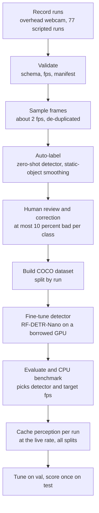
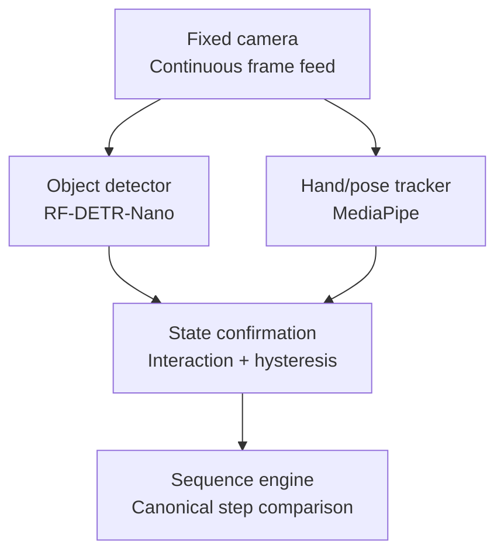
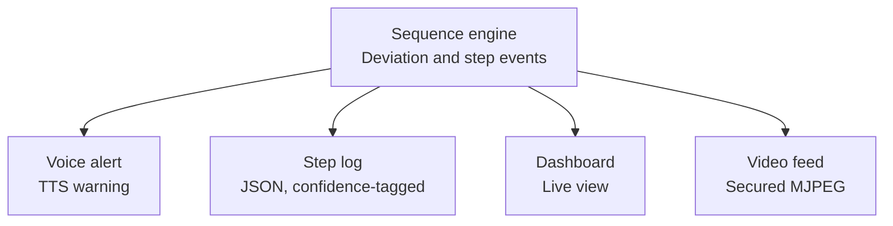

# Project context: AI Human Activity Recognition for On-board BAS Experiments (SIH 2026, PS 26174)

This document is self-contained. It assumes no prior knowledge of this project. If you are an engineer, reviewer, or an AI coding agent picking this up cold, reading this file top to bottom should be enough to understand what is being built, why every major decision was made the way it was, and where to find feature-level detail.

## How the documents fit together

- **`context.md`** (this file) — the problem, all research and evidence, every decision and the reasoning/alternatives behind it, and the complete solution architecture.
- **`essential-features.md`** — the **implementation spec** for every must-build (Tier 1) feature: the contract it satisfies, how to build it (libraries and calls), parameters, pitfalls, and where its test is defined. Links back here for the "why."
- **`non-essential-features.md`** — every optional/deferred (Tier 2) feature and everything explicitly excluded from scope, and why.
- **`IMPLEMENTATION_PLAN.md`** — who builds what and in what order; the complete tech stack and compute environments; the exact behavior of the state tracker, engine, outputs and runtime; the dataset pipeline; testing, git and merge rules; phase gates; and one work packet per agent session.
- **`contracts.py`** — the executable contract: every shape, vocabulary and function signature that crosses a person's directory. It wins if any document disagrees with it.
- **`AGENTS.md`** (loaded via `CLAUDE.md`) — short rules and prompts for an agent session. **`ISSUES.md`** — the append-only log of contract gaps, blockers and decisions.
- **`DATA_COLLECTION.md`** — a standalone guide for the crew who record the data (no engineering background needed).

**Reading order for someone new (or a fresh agent session):** this file §1–§3 → `IMPLEMENTATION_PLAN.md` Parts 1–4 → your work packet in Part 10 → the feature spec(s) it names → `contracts.py` for your types.

---

## 1. The problem statement

This is Smart India Hackathon (SIH) 2026, Problem Statement 26174, "AI Human Activity Recognition for On-board BAS Experiments," posed by ISRO. The team is six pre-final-year BTech AI & DS students, currently past the internal-hackathon round and preparing the PPT and prototype for the national online-screening round.

**BAS** is the Bharatiya Antariksh Station — India's own planned space station, with the first module targeted for [2028 and full completion by 2035](https://en.wikipedia.org/wiki/Bharatiya_Antariksh_Station), where astronauts would run scientific experiments.

**The stated problem:** communication delays and restricted bandwidth make continuous ground-control support for on-board experiments impractical (this is explicitly worse for lunar missions but already a constraint for a station in Earth orbit). The task is to build an AI system that:
- Continuously processes local video from **fixed-payload cameras** (not a wearable device) to track the sequence of a predefined experiment.
- Suggests the next step at the start and after each step.
- Detects and voice-alerts on skipped or out-of-order steps.
- Generates a timestamped, structured, lightweight text log of steps and outcomes.
- Streams video to a specified IP and stores it locally.
- Provides a GUI for monitoring.
- Runs fully offline on a standalone system.

**Optional stretch requirement:** because astronauts have no fixed "up" in microgravity, standard ground-based pose estimation may fail; the optional ask is orientation-agnostic 3D Human Mesh Recovery (HMR), tracked relative to the payload rack rather than a floor plane.

**Dataset:** ISRO does not supply one. The problem statement explicitly says teams must build a custom, focused dataset, "even just using a webcam," and gives a minimal, genuinely truncated example ("a box that contains two smaller boxes of color red and yello[w]"). A screenshot of the official SIH portal listing confirmed the text is cut off in ISRO's own source, not a copy-paste error — there is no fuller version to find anywhere else online. **This means the exact experiment sequence is not something to discover; it is something this team designs.**

**No prior-year precedent exists.** SIH 2024 and SIH 2025's ISRO problem statements (checked against the [official SIH 2024 press release](https://www.pib.gov.in/PressReleasePage.aspx?PRID=2083360) and ISRO's separate Bharatiya Antariksh Hackathon) contained no HAR/astronaut-activity-monitoring statement, and no public team work for PS 26174 specifically was found anywhere online. This is a genuinely new problem statement with no repo, no PPT, and no results to benchmark against.

**Constraints given by the team, which shape nearly every decision below:**
- **One week** from problem-statement lock to PPT/prototype submission for the national online-screening round.
- **No Jetson Nano/Xavier or Raspberry Pi available** — the *runtime* target for this round is a laptop CPU only, no dedicated edge accelerator or GPU. (This is a deployment constraint: fine-tuning the detector is a one-off offline job that borrows a GPU — see "Compute environments" in §11.)
- The team plans **agent-assisted development** (Claude Pro) to accelerate the build within that week.

---

## 2. What this problem actually decomposes into

Stripped of the space framing, the requirements translate to:

| Requirement | Technical translation |
|---|---|
| Track sequence of a pre-defined experiment | Closed-set procedural step recognition — not generic HAR (walk/sit/run); the exact steps are known in advance |
| Suggest next step | An ordered checklist compared against the recognized current state |
| Alert on skip/out-of-order (voice) | Sequence-conformance checking + TTS |
| Structured log | Plain software: timestamped JSON/CSV |
| Stream + store video | Video streaming (RTSP/RTMP/WebRTC or MJPEG) + local storage |
| GUI | Dashboard |
| Optional 3D HMR | Orientation-agnostic pose relative to a rack, not a floor |

---

## 3. What kind of AI problem this is

This is a **hybrid** system, not a single end-to-end model:

- **Perception layer (deep learning):** object detection (experiment props, hands) + hand/pose tracking.
- **Sequence-validation layer (lightweight, non-learned logic):** comparing the observed sequence of recognized states against a known canonical order.

This split is evidenced, not assumed. A comprehensive 2025 survey of the field ([Vision-Based Mistake Analysis in Procedural Activities](https://arxiv.org/pdf/2510.19292)) categorizes methods by how much procedural structure they encode, and finds that rule-based graph methods — domain knowledge expressed as explicit procedural rules, often defined by experts — are well-suited to high-precision domains such as industrial assembly or medical workflows, where deviations from the rule-defined paths are critical indicators of mistakes. The same survey shows that even with huge training sets, general open-world mistake detection is still hard — the [HoloAssist dataset paper](https://arxiv.org/pdf/2309.17024) reports its best mistake-detection model reaching only around a 40 F-score. Given this team has one week and a small self-recorded dataset, training an end-to-end "is this sequence correct" model would mean fighting the field's hardest, still-unsolved problem. A closed, single, author-defined experiment does not need that: the deep model only has to say what state the scene is in; a deterministic template comparison (below) does the actual judgment call.

---

## 4. Prior art and competitive landscape

### Space-specific AI assistants

- **[CIMON / CIMON-2](https://www.airbus.com/en/newsroom/press-releases/2020-04-cimon-2-makes-its-successful-debut-on-the-iss)** (Airbus + IBM Watson, on the ISS since 2018) — a voice-controlled floating assistant that shows procedure instructions and records video of experiments autonomously. **Gap:** it displays instructions; it does not verify execution via computer vision.
- **[NASA Astrobee](https://www.nasa.gov/wp-content/uploads/2017/12/irg-ff029-astrobee-guest-science-guide.pdf)** — three free-flying robots on the ISS, a general-purpose computer-vision research platform used for remote monitoring. **Gap:** not procedure-specific.
- **[NASA Project Sidekick](https://spinoff.nasa.gov/page/fix-it-like-an-astronaut-with-augme) / Procedure Genius** (Tietronix) — a HoloLens-based AR system with a "Procedure Mode" overlaying step-by-step instructions on real hardware, operational on the ISS since 2015/2016. **Gap:** this is guidance (showing what to do next), worn on a headset — not passive, camera-based verification that a step was actually, correctly executed. A fixed payload camera (what PS 26174 specifies) is also architecturally different from a worn headset: no device on the astronaut, closer to true hands-free passive monitoring.

### Industrial precedent (non-space)

- **[Drishti Technologies](https://www.therobotreport.com/drishti-denso-join-apply-computer-vision-human-productivity/)** — a real, funded, commercially deployed company (customers include Ford, Nissan, Honeywell, Flex, DENSO, HELLA) that puts a camera at each manual-assembly workstation and trains an "action recognition" model per station to verify task execution and flag bottlenecks in real time. This validates the entire core approach (fixed camera + AI action verification) at commercial scale — just for car assembly, not space.

### The directly matching academic field

The closest matching research area is **procedure step recognition / mistake detection in procedural activities**. Key datasets and why they matter:

- **[Assembly101](https://arxiv.org/abs/2203.14712)** (CVPR 2022) — 4,321 videos of toy-vehicle assembly/disassembly, the first dataset to formally define a "mistake detection" task (missing/out-of-order steps).
- **[IndustReal](https://github.com/TimSchoonbeek/IndustReal)** ([WACV 2024 paper](https://arxiv.org/abs/2310.17323)) — the single closest precedent. It defines "procedure step recognition (PSR)," and its own architecture is: a YOLOv8-m-based Assembly State Detection module recognizes the current visual state, followed by a Procedure Step Recognition stage that maps detected states to step sequences via non-parametric heuristics, comparing against a template defined by task instructions. This is essentially the blueprint this project follows — perception model + deterministic rule layer. Code and trained weights are public.
- **[HoloAssist](https://arxiv.org/abs/2309.17024)** — 166 hours of egocentric interaction data, mistake-detection benchmarks (the ~40 F-score result cited above).
- Also reviewed: MECCANO, CaptainCook4D, EgoPER, EgoOops, Ego-Exo4D, BRIO-TA, ATA, Epic-Tent, EK-M/Ego4D-M — none feature this project's specific objects (box, red box, yellow box) or a space/microgravity setting, which is exactly why the dataset must be self-generated (Section 5).

**Procedure Order Similarity (POS):** IndustReal's own evaluation metric — a Damerau-Levenshtein edit-distance comparison between the observed step sequence and the canonical one — is reused directly in this project's sequence engine (Section 7).

### VLM / LLM-based approaches — considered and ruled out for the core loop

A September 2025 benchmark, [ProMQA-Assembly](https://arxiv.org/pdf/2509.02949), tests GPT-4o, GPT-5, Gemini 2.5 Pro, and Claude 3.7 Sonnet on exactly this class of question (missing steps, order errors) in assembly video. These are all cloud APIs — disqualified from the real-time detection loop by the problem statement's own offline requirement. Locally-hostable open-weight VLMs (Qwen2.5-VL, InternVL2) exist but need real GPU compute to run at usable speed, which this team's laptop-only hardware does not have. Verdict: keep the perception layer to small, purpose-built models (Section 6), not a general VLM, in the real-time path.

---

## 5. Dataset strategy

**Decision: generate a custom dataset. No existing dataset is a substitute, and none is needed.**

Evidence:
- Every dataset reviewed above uses different physical objects (toy vehicles, industrial parts, kitchens) in non-space settings — object classes and step sequences are inherently task-specific.
- The problem statement itself already instructs this ("even just using a webcam").

**Labeling-effort shortcut:** open-vocabulary, zero-shot detectors let this team skip most manual annotation. [YOLO-World](https://github.com/ailab-cvc/yolo-world) (Tencent AI Lab, CVPR 2024) detects objects from a text prompt with no training data at all, and is roughly 20x faster and 5x smaller than earlier open-vocabulary detectors like Grounding DINO while retaining comparable accuracy ([Roboflow's overview](https://blog.roboflow.com/what-is-yolo-world/)). Plan: record footage of the chosen experiment → run YOLO-World/Grounding DINO over the frames with text prompts ("red box," "yellow box") to auto-generate pseudo-labels → spot-check → fine-tune the final small closed-set detector on that pseudo-labeled data. This turns a labeling job into an hours-not-days task.

### The practice experiment: Sample Transfer

ISRO's example is truncated and no fuller version exists, so this team designs the experiment. Design criteria, in order: (1) it resembles an on-orbit payload procedure; (2) it uses everyday objects; (3) every step is detectable from **position relations between objects** (a box is inside/outside a container, a hand touches a control), not from subtle appearance (lid open vs closed) — box relations are far more robust than fine appearance differences; (4) one linear, single-valid-order sequence of 6–10 steps; (5) **every step's rule must be able to go false before that step's turn** — a rule already true when the run starts (here the two "stowed" steps) is latched at baseline and re-arms only after the objects have left, whereas a rule that never goes false can never fire (§8 explains why this is mandatory; wording revised 2026-09-28, see `ISSUES.md`); (6) every deviation type can be performed physically and safely.

**The experiment:** five objects — an open-topped `outer_box` holding a `red_box` and a `yellow_box` (ISRO's own hint), a `tray` (the "experiment chamber"), and a green `start_button` (the "control panel"). A camera looks straight down at a taped ~50 × 35 cm workspace. Seven steps:

| # | Step | Rule (position-based) |
|---|---|---|
| 1 | `red_out` | red box **outside** the outer box |
| 2 | `red_in_tray` | red box **inside** the tray |
| 3 | `yellow_out` | yellow box outside the outer box |
| 4 | `yellow_in_tray` | yellow box inside the tray |
| 5 | `start_pressed` | a hand landmark **touches** the START button |
| 6 | `red_stowed` | red box inside the outer box (again) |
| 7 | `yellow_stowed` | yellow box inside the outer box (again) |

**Why this resembles the real domain (evidence).** The ISS Microgravity Science Glovebox is described as a "[workbench](https://ntrs.nasa.gov/api/citations/20090017703/downloads/20090017703.pdf)" environment — an enclosed work area where the crew installs and handles experiment hardware, with [powered video drawers and cameras monitoring the investigations](https://www.eusoc.upm.es/microgravity-science-glovebox/). Crews [change samples and perform operations](https://www.sciencedaily.com/releases/2002/06/020617075754.htm) there; NASA's daily reports describe [sample-preparation steps inside a glovebox](https://www.nasa.gov/blogs/stationreport/2020/10/page/2/), and ground-written procedures are [performed in sequence by the crew](https://spaceref.com/?p=94029). Our experiment reproduces that *structure*: a bounded workspace, a fixed camera, ordered handling of containers, and a panel action. **Honest limit:** the real BAS procedures are not public; this is an analogue, not a replica.

**Additional evidence (added 2026-09-28).** *Real crew handling looks like our steps.* On ISRO's Ax-4 mission the Indian astronaut [deployed and stowed microalgae, and photographed sprouting seeds in petri dishes before inserting them into a storage freezer](https://www.theweek.in/wire-updates/national/2025/07/09/del37-space-shukla.html); ISS crews [insert sample containers into the MELFI freezer](https://www.nasa.gov/image-detail/amf-iss073e0424037) and [replace its dewar trays](https://www.nasa.gov/?p=417266). Retrieve, place, operate and stow is the vocabulary of Sample Transfer. ISRO's astronaut said the Ax-4 experiments were [designed with Gaganyaan, the Indian station and a lunar mission in mind](https://www.outlookbusiness.com/news/axiom-4-mission-facilitated-microgravity-research-in-india-says-astronaut-shubhanshu-shukla). *The problem is recognised.* NASA's Human Research Program tracks a [risk that crews cannot execute complex procedures with diminished ground support](https://hsi.arc.nasa.gov/publications/AHFE_2024_Parisi.pdf); one-way delays are [3–14 s for lunar missions and up to 22 minutes for Mars](https://ntrs.nasa.gov/api/citations/20250003885/downloads/NASA%20TM20250003885.pdf); and a NASA [planning presentation lists motion tracking among approaches to procedure-execution support](https://ntrs.nasa.gov/api/citations/20160013294/downloads/20160013294.pdf) (posed there as a question, not a result). *Why an engine plus a swappable experiment file.* The government describes BAS as a [national laboratory for multidisciplinary microgravity experiments](https://www.globalsecurity.org/space/library/news/2024/space-241211-india-pib01.htm) (a mirror of the PIB reply). **Further honest limits:** no public BAS procedure was found in this pass; our rules are defined in image space relative to the camera and payload, not relative to gravity, and the PPT should say so rather than claim microgravity realism; and real tasks include a photo-documentation step that this experiment does not have.

**Alternatives considered.** An earlier draft used appearance-based steps ("open the outer box", lid open/closed). It was set aside: lid state is a fine appearance difference, and a closed opaque outer box hides the inner boxes from the camera entirely. A front-facing camera was set aside for depth ambiguity: the rules test 2-D containment, and only an overhead view makes 2-D containment approximate physical containment.

**Scope for this round (locked 2026-09-28): Sample Transfer is the only experiment.** A second experiment is Tier 2 (`non-essential-features.md` §6).

**Verified in simulation, not just argued.** A reference implementation of the tracker (Plan §5.3) and the engine (Plan §5.4) was run on a synthetic 15 fps world of this experiment. All ten planned variants — correct, three skips, three swaps, two repeats, idle — produced exactly the intended step-event sequence, and the engine reported the intended deviations.

### How much data, and how it is split

The crew records **77 runs** (`runs/run_plan.csv`): **36 train, 14 val, 27 test**; by type, 22 correct, 15 skip, 11 swap, 10 repeat, 5 idle and 14 robustness (dim light, gloves as an astronaut-glove analogue, distractor objects with a second hand, double speed). Three operators appear throughout and a **fourth appears only in the test set**, to measure generalization to an unseen hand; a second lighting setup covers 11 runs.

The counts are **judgment calls with no evidence base** — no source says "the right number of runs" — sized against three concrete targets: (a) after near-duplicate removal the train runs yield about 2,000–3,000 images, inside the ranges RF-DETR's fine-tuning guidance gives (roughly < 500 images → 100–200 epochs, 500–2,000 → 50–100, 2,000–10,000 → 30–50); (b) every deviation variant appears in both val and test; (c) the whole plan is about 2.6 hours of recording. If the detector under-performs, add `correct` runs first.

**Anchors and a caution (added 2026-09-28).** The closest precedent, IndustReal, has [84 videos from 27 participants, about 6 hours in total](https://timschoonbeek.github.io/industreal.html), with 38 errors, 14 of them only in validation and test; our 77 runs (~2.6 h) match it in run count with shorter clips, and our unseen-operator test set follows the same principle. Ultralytics' general guidance asks for [at least 1,500 images and 10,000 instances per class, with image variety representative of deployment](https://docs.ultralytics.com/yolov5/tutorials/tips_for_best_training_results); Sample Transfer has about one instance per class per image, so ~2–3k instances per class is below the instance figure. That guideline is written for YOLOv5 datasets and no RF-DETR equivalent was found, so treat it as a caution: spend the budget on **variety** (operators, both lighting setups, backgrounds, small camera nudges) rather than more identical runs. RF-DETR's docs recommend a [conservative augmentation preset under 500 images and an aggressive one above 2,000](https://rfdetr.roboflow.com/latest/learn/train/augmentations); see `essential-features.md` F14 stage 6 for how we use that. **Stop rule for extra runs:** after the first training pass, fine-tune once more on about 50% of the train runs; if val mAP and the replay-golden pass rate barely move, do not record extra `correct` runs. The rule can only justify skipping *extra* train runs: val and test sizes are set by what evaluation needs and stay complete.

**Splits are by run, never by frame** — adjacent frames are near-duplicates, so a frame-level split would leak. `train` teaches the detector; `val` tunes thresholds; `test` is scored once per model version and never tuned on. The performer's declared `performed_steps` per run is the ground truth for the whole evaluation; no per-frame hand labeling is needed, and a contract test re-derives the expected alerts from each declaration so a mislabeled clip cannot silently corrupt the golden set.

### How the data is processed

Eleven stages — record, validate, sample frames, auto-label, human review and correction, build the COCO dataset, fine-tune on a GPU, evaluate, CPU-benchmark, cache the perception output per run, then tune on val and score on test. Each stage has explicit inputs and outputs and a gate (for example: no more than 10 % bad labels per class in the human review). Implementation detail: `essential-features.md` §14; order, owners and gates: `IMPLEMENTATION_PLAN.md` §5.7; the crew's view: `DATA_COLLECTION.md`.

**Label quality and correction (decided 2026-09-28).** Hand-fixing every box is not feasible: about 2,000–3,000 train images × 5 objects is roughly 10,000–15,000 boxes, the 10 % gate would let 1,000–1,500 bad boxes through, and the review only samples about 40 frames per class. So correction is targeted. (1) The three static objects are checked and fixed once per run, which covers every frame of that run. (2) A **gold subset** of `val` and `test` frames (about 6 per run) is hand-verified and used for the detector's acceptance numbers; otherwise the detector would be scored against the auto-labeler's own labels, and label errors in evaluation sets are known to distort conclusions ([Northcutt et al.](https://arxiv.org/abs/2103.14749)). The headline step-detection numbers are unaffected, because they are scored against the crew's declared steps. (3) Uncertain training frames are excluded rather than corrected. The tool is a small static, offline HTML page (`training/label_editor/`) that uses the same class list and pixel coordinates and writes a separate overlay file. Label Studio ([Apache-2.0](https://github.com/HumanSignal/label-studio), pip-installable, but needs a converter, local-file serving and a database) and CVAT ([MIT](https://github.com/cvat-ai/cvat); Docker Compose stack in the install guides seen) were not adopted: both are heavy for a few hundred edits and add a class-id conversion step where an off-by-one would swap red and yellow. Details: `essential-features.md` F14 Stage 4b.

---

## 6. Perception model choices

### Camera hardware

Decision: one fixed, standard USB/laptop webcam, mounted stationary — not a phone streamed over Wi-Fi, and not multiple cameras. Reasoning: the problem statement's own dataset guidance explicitly permits building the dataset "even just using a webcam," which removes any pressure toward exotic capture hardware. A phone-as-IP-camera setup (e.g. an IP Webcam app) adds a Wi-Fi/app dependency that risks failing during a live demo, for no accuracy benefit at this stage. A single fixed viewpoint also matches the problem statement's own wording ("fixed-payload cameras") more literally than a handheld or worn device would, and multi-camera fusion is complexity the problem never asks for. The ingestion module (Feature 1 in `essential-features.md`) is still built source-agnostic — accepting a device index or a stream URL identically — so a real payload IP camera is a one-line swap later, not a redesign.

**Placement and mode (added after simulating the rules).** The camera looks **straight down** from about 50–60 cm, capturing **1280 × 720 at 30 fps**, with exposure and white balance locked where the camera allows (auto-exposure drift shifts colours and confuses red vs yellow). The reason is geometric: the step rules decide "inside/outside" from 2-D box positions, and only an overhead view makes that a fair proxy for physical containment; a front camera cannot tell a box held in front of the outer box from one inside it. The processing rate is separate from the capture rate (see §8).

### Object detection: RF-DETR (not YOLO) — and why this reversed an earlier decision

YOLO (v8/11/26, via Ultralytics) was the original recommendation on pure technical merit: fast on CPU, one-hour fine-tuning workflows are commonly documented, and [YOLO26 specifically targets CPU inference](https://docs.ultralytics.com/) with up to 43% lower latency than earlier versions.

**That recommendation was reversed after checking licensing, not performance.** Verified directly against [Ultralytics's own licensing page](https://www.ultralytics.com/license): every Ultralytics YOLO model (v8, 11, 26 — all of them) is AGPL-3.0 by default, and this license's obligations trigger on network use — embedding the model in a product or exposing it through a hosted API requires open-sourcing the entire integrating application, or purchasing a commercial Enterprise License. This project has a GUI and streams video over a network — exactly what AGPL is written to catch. For a hackathon submission this is a non-issue, but the team explicitly wants the SIH architecture to be the same one that scales toward a real ISRO deployment (Section 10) — and a national space agency being forced to either open-source its flight software or pay a third-party US company for a license on core perception software is a real, avoidable problem.

**The evidence-backed alternative: [RF-DETR](https://github.com/roboflow/rf-detr)** (Roboflow, released March 2025, accepted ICLR 2026). Apache 2.0 licensed for its Nano/Small/Medium/Large sizes — no copyleft obligation at all. On performance: it is the first real-time model to exceed 60 mAP on COCO, and — more relevant here — it leads RF100-VL, the benchmark measuring domain adaptability to real-world custom datasets with limited training data ([Roboflow's RF-DETR announcement](https://blog.roboflow.com/rf-detr/)), which is exactly this project's situation (a tiny, custom, few-object dataset).

**Open caveat, stated honestly rather than assumed:** every published RF-DETR latency figure (e.g., 2.3ms for the Nano variant) is measured on an NVIDIA T4 GPU with TensorRT. No confirmed CPU-only benchmark was found comparable to YOLO11n's CPU figure (56ms on ONNX, per [Ultralytics's own comparison](https://docs.ultralytics.com/compare/yolo11-vs-yolov8)). **Action item: benchmark RF-DETR-Nano vs. YOLO11n on the team's actual laptop CPU before finalizing** — the decision is evidence-led on license and limited-data accuracy, not yet confirmed on raw CPU speed.

**Verified against RF-DETR's own documentation:** the Nano variant runs at 384 × 384 with about 30.5 M parameters and is Apache-2.0; training takes a COCO-format dataset (`train/`, `valid/`, `test/`, each with an `_annotations.coco.json`) through a single `train()` call, with an effective batch size of 16 (batch 4 × gradient accumulation 4 on a T4-class GPU) and early stopping on validation mAP; a fine-tuned checkpoint loads through `pretrain_weights=`; `predict()` expects **RGB** input and returns a `supervision.Detections`; and `optimize_for_inference()` is documented as giving up to ~2× speedup. An ONNX export exists for CPU deployment; third-party model cards claim it is faster than PyTorch on CPU, which is **unverified here and is part of the benchmark**. Because fine-tuning a transformer detector is a GPU job, training runs on a borrowed GPU (below); only inference must fit the laptop CPU.

**Detector decision rule (added 2026-09-28; proposed, both people ack at G0).** The detector is chosen **once**, at P1.5, and stamped. The runtime never switches detectors automatically: a second model means a second `model_stamp`, rebuilt caches and a separate license decision. YOLO11n (AGPL-3.0) is used only if, after one fix cycle, (a) RF-DETR-Nano cannot reach `min_pipeline_fps` on the demo laptop under PyTorch or ONNX Runtime, (b) it misses the recall thresholds in `config/acceptance.yaml` on `val`, or (c) no GPU can be made to run its fine-tune (the fallback is then a slow CPU fine-tune of YOLO11n). ONNX Runtime is tried before YOLO for case (a). Whichever ships, the license decision is logged in `ISSUES.md`.

### Hand/pose tracking: MediaPipe

[MediaPipe](https://github.com/google-ai-edge/mediapipe/blob/master/docs/solutions/hands.md) (Google) — Apache 2.0 licensed, infers 21 3D hand landmarks per frame and achieves real-time performance even on a mobile phone, with zero fine-tuning needed. Considered and set aside: [the 100DOH hand-object detector](https://github.com/ddshan/hand_object_detector) — more accurate on contact-state classification, but a heavier Faster R-CNN model, harder to run in real time on a bare laptop CPU.

### Hand-object interaction: geometric heuristic, not a model

A distance/overlap check between MediaPipe hand landmarks and a detected object's bounding box — no dedicated interaction-classifier model. This mirrors IndustReal's own "non-parametric heuristics" design choice.

### Voice output (TTS)

The problem statement mandates a voice-based alert; the system must be offline. **Decision (Tier 1): `pyttsx3`, which drives the operating system's own installed voice** (SAPI5 on Windows, NSSpeechSynthesizer on macOS, eSpeak on Linux). It works fully offline, has nothing to download or vendor, and the utterances are short phrases where intelligibility matters more than naturalness.

**Known weakness, and the design that follows from it.** pyttsx3's `runAndWait()` has long-standing hang reports on some macOS setups, and the workaround users report is to run it in a child process and kill that process to interrupt speech. So speech runs in a **separate worker process**: an `alert` interrupts by restarting the worker, and the system can never block on audio. With no audio device the worker degrades to silence with one logged warning.

**Upgrade path (Tier 2), with the license facts checked.** Piper's original repository was archived in October 2025 and development moved to `piper1-gpl`, whose releases changed the license to **GPL-3.0** — relevant for a system meant to scale toward an agency deployment, the same concern that drove the RF-DETR-over-YOLO decision. Kokoro-82M is Apache-2.0 and, per its packagers, CPU-real-time (~340 MB with its ONNX runtime; ~300 ms in-process latency, a third-party figure). Because **every utterance in this system comes from a closed, finite set** (each step's `say` phrase, the alert templates × the step display names, and the completion phrases), a higher-quality voice can be used *offline at build time* to pre-render WAV files, with pyttsx3 as the fallback for anything uncached — so runtime synthesis latency and TTS hangs disappear without any new runtime model. Transitive dependency licenses (for example phonemizers) must be checked before adoption.

### The optional task: orientation-agnostic 3D HMR

Real research exists on human motion in microgravity/reduced gravity — parabolic-flight studies using Azure Kinect motion capture rigs or IMU-based wearable garments to study astronaut orientation and proprioception (e.g. [testing XR technologies in a partial-gravity parabolic flight campaign](https://arxiv.org/pdf/2410.14922)) — but none of it is public, RGB-video, or SMPL-annotated, so there is no dataset to shortcut this task with directly. What is usable is the *method*: [BEDLAM](https://arxiv.org/html/2306.16940v1) proved that neural networks trained only on synthetic, rendered SMPL-X bodies achieve state-of-the-art 3D human pose and shape accuracy on real images — no real photos needed for training at all. The adapted plan, if attempted, is to render a small synthetic set of SMPL-X bodies at randomized orientations relative to a virtual payload-rack plane (instead of BEDLAM's ground-plane assumption) and fine-tune a lightweight HMR head on that. This remains a stretch goal for the timeline (see `non-essential-features.md`), but it is an adapted, evidenced methodology rather than an unguided research problem.

---

## 7. The sequence engine (the project's core logic)

This is the one component that is fully our own code, with no third-party model or license exposure.

**Design principle — don't over-formalize the experiment.** A genuine concern was raised: does describing the experiment in enough detail for the system to check require exhaustively modeling every way a human might correctly perform it? The literature's hardest version of this problem (distinguishing legitimate execution variation from true error) is real and unsolved — but this project does not have to solve it, for a specific reason: **the team is the author of the experiment**, not a researcher reverse-engineering one from footage. [Graph2Vid](https://ar5iv.labs.arxiv.org/html/2210.04996) demonstrates the field's own lightest-weight approach explicitly: instead of requiring the actual order of procedure steps in the video to be annotated, it works from generic procedural text that is not tied to a specific video at all — i.e., a plain written step list. This project's "template" is exactly that: a short, self-authored, deliberately linear (single-valid-order), discrete-state list — recommended length 6–10 steps, each mapped to one simple detectable condition already produced by the perception layer (an object's open/closed state, or a hand-object interaction event). Writing this is a single working session, not a research effort, and it deliberately excludes execution-quality checking (grip, technique) and branching/alternate valid orderings — both are explicitly out of scope, and the technique-quality kind is still an open research problem field-wide, not something this project is expected to solve.

**Mechanism:** perception produces per-frame evidence; a rule-based **state tracker** turns it into one *step event* whenever a step's position rules have risen and held for several consecutive frames; the engine then classifies each step event against the canonical order with a small deterministic decision table — the expected step is confirmed; a later step seen first is an **omission** (the earlier steps are reported skipped); a skipped step performed late is **out of order**; an already-done step seen again is a **repeat**. The exact table, including its disclosed edge cases, is in `IMPLEMENTATION_PLAN.md` §5.4. **Procedure Order Similarity** (from IndustReal) is computed for each run's summary: $POS = 1 - \min\left(\frac{DamLev(\mathcal{P}, \hat{\mathcal{P}})}{|\mathcal{P}|}, 1\right)$, where $DamLev$ is Damerau-Levenshtein edit distance — and a property test asserts the two views agree (the engine flags a deviation exactly when the observed sequence differs from the canonical prefix).

**Why this design is separately mission-appropriate, not just fast:** the engine (comparison logic) and the data (the specific step list) are cleanly separated. A future, more complex real ISRO experiment just means authoring a longer list and handing it to the same engine — the mission-critical qualities (below) live in the engine, not in how elaborate the demo experiment is.

---

## 8. Reliability engineering

A 2025 National Academies report, [Machine Learning for Safety-Critical Applications](https://www.nationalacademies.org/read/27970/chapter/2), states plainly that ML components will never be perfect and system design must take this into consideration — systems need an "outer loop" where novel/uncertain situations are detected and characterized rather than silently misclassified. Three patterns adopted directly from this framing:

1. **Confidence-thresholded rejection, calibrated.** Detections below a floor (default 0.30) are treated as "unknown" and never acted on; events whose supporting confidence is between the floor and a confirm level (0.60) are acted on but **tagged `flagged_uncertain`** in the log — an audit trail without manual sign-off. Caveat: deep networks tend to be overconfident even when wrong ([multiple](https://ar5iv.labs.arxiv.org/html/2303.14404) [studies](https://scio.readthedocs.io/stable/user_guide/ood_detection.html)), so raw confidence scores need a calibration sanity-check on held-out data, not blind trust.
2. **Temporal consistency: hysteresis, baseline latch and release.** A step's rules must hold for N consecutive processed frames before the step fires (this also partly defends against single-frame glitches and adversarial patches, which are typically evaluated frame-by-frame); rules already true in the first frames after a reset are latched and cannot fire; a fired step re-arms only after the rule has been false for several frames. **Two consequences were found by simulation and are design constraints:** (a) a step whose rule is already true at the start of a run is latched and cannot fire until the rule has gone false and re-armed (in the test a first step with a true-at-start rule fired *fifth* instead of first), so every step's rule must be able to go false before its turn — Sample Transfer's two stow steps start true and are released when the boxes leave the outer box (wording revised 2026-09-28; see `ISSUES.md`); (b) hysteresis is counted in *frames*, so the required dwell time grows as the processing rate falls — the sample experiment fired 7/7 steps at 15, 10 and 6 fps but only 5/7 at 4 fps. The live pipeline therefore has a minimum rate (8 fps), the recorded-run caches are built at the live rate, and the thresholds are tuned at that rate.
3. **Cross-modal agreement.** A step is only confirmed when both the object detector and the hand tracker agree, not either alone — the standard safety-engineering idea of not trusting one sensor for a critical decision. In the Tier-1 build this applies where a step *is* a hand action (the START press needs both the button detection and a hand landmark inside it); requiring hand-plus-detector agreement for *every* step is the Tier-2 "cross-modal redundancy voting" item.

---

## 9. Security considerations

- **Video stream:** RTSP/MJPEG deployments fail in predictable ways — default credentials left enabled, unencrypted streams, credentials embedded in plaintext URLs ([Elliptic's RTSP security guidance](https://www.elliptic.co/corpus/gen-3573/real-time-streaming-protocol/rtsp-security-authentication-and-encryption-best-practices.html)). Mitigation: serve over HTTPS, require basic auth, never hardcode credentials into a URL.
- **Adversarial patch attacks on object detectors** are a real, documented threat category ([survey](https://arxiv.org/html/2410.19863v2)) but disproportionate to build a dedicated defense for here: this is a controlled, cooperative, single-purpose demo environment with no adversary present. The temporal-hysteresis requirement above is a partial, already-present mitigation. Decision: acknowledged and consciously scoped out, not ignored.
- **Model integrity:** a lightweight checksum on the trained weights file, so the running system can verify it loaded the model it was meant to, not a corrupted or substituted one.

---

## 10. Mission-criticality framing

### One architecture, staged completeness — not two systems

The framework used to resolve "build for the demo vs. build for the real mission" is [Technology Readiness Levels (TRL)](https://www.nasa.gov/directorates/somd/space-communications-navigation-program/technology-readiness-levels/), the NASA-originated 1–9 scale ISRO/ESA also use. TRL 1–3 is analytical/experimental proof-of-concept; TRL 4–6 is prototype validation in an increasingly realistic environment; TRL 7–9 is deployment. Each step up the ladder is a continuous maturation of the *same* technology, reducing technical uncertainties — not a discard-and-rebuild. The SIH deliverable maps to roughly TRL 3–4. This is also consistent with how the software industry frames early-stage deliverables: a [proof of concept explicitly answers "can this be built at all," and is expected to have a narrower scope than what follows](https://kanerika.com/blogs/proof-of-concept-vs-prototype/) — that's the defined purpose of this stage, not a corner cut.

**What actually differs between the SIH build and a real mission system is not the architecture** — it's feature completeness (3D HMR is a stretch, not core), reliability/security depth (basic thresholding now vs. full calibration and redundancy later), data scale (one small custom dataset vs. eventually much larger and more diverse), target hardware (laptop now vs. space-rated compute later, out of scope for a software team regardless), and validation rigor (demo-tested now vs. formal verification later).

### The honest structural caveat: no current deep-learning detector is certifiable in the strict sense

Checked directly against the standard that actually defines "mission-critical" for airborne/spaceflight software (DO-178C and equivalents): a NASA-authored analysis states that DO-178C's traceability objectives are not achievable for an ML model ([NASA/NTRS paper](https://ntrs.nasa.gov/api/citations/20210019093/downloads/main.pdf)), and a separate aviation-certification analysis frames the core reason precisely — the link between requirements and implementation is statistical rather than deterministic for any trained neural network, with no line of code traceable to a requirement ([CoDANN finding, cited here](https://arxiv.org/pdf/2606.25120)). This is a field-wide unsolved problem (EASA has a roadmap and a draft standard, ARP6983, still in development), not a flaw specific to any model choice made in this project. **Consequence: this system is correctly framed as an advisory-tier assistant — it observes, logs, and alerts a human, and does not autonomously actuate or gate the experiment.** This matches exactly what PS 26174 asks for (suggest, alert, log — never "control"), and stating this explicitly is a mark of engineering maturity, not a weakness to hide.

---

## 11. Solution architecture — complete app flow

### Offline, one-time: dataset and training pipeline

### Compute environments: where each step runs

| Environment | Runs | Internet |
|---|---|---|
| Dev laptops (two developers, CPU) | all code, tests, the runtime, benchmarks, cache builds | at install time only |
| A borrowed GPU (Colab/Kaggle notebook or any GPU box) | the fine-tune (and optionally auto-labeling, which is faster there) | yes (dev-time only) |
| The crew's recording rig | recording | no |
| The demo laptop | the live system — **offline, runtime dependencies only** | none |

The runtime must never touch the network; models and vendored files are copied in beforehand and a test blocks outbound sockets. If no GPU is reachable at all, the fallback is a slow CPU fine-tune of a smaller model (with its own license implication), decided and logged at the detector-training session.

**Kaggle and Colab are not interchangeable (added 2026-09-28).** Kaggle documents a [weekly GPU quota of about 30 hours](https://www.kaggle.com/docs/efficient-gpu-usage) and offers a T4 ×2 option beside the P100. A March 2026 report says Kaggle's default PyTorch build [lacked P100 (sm_60) kernels, with conflicting comments on whether T4 is also affected](https://github.com/Kaggle/docker-python/issues/1546); its status today is unverified, so run a short forward-and-backward smoke test on the assigned accelerator before relying on it. Colab's free tier has [no guaranteed GPU, roughly a 90-minute idle timeout and a ~12-hour cap](https://www.spheron.network/blog/google-colab-alternatives-8-gpu-clouds-compared-2026/) (a third-party summary of Google's FAQ), so it is the backup. RF-DETR's official Colab notebook [fine-tunes the Nano model on a T4](https://colab.research.google.com/github/roboflow-ai/notebooks/blob/main/notebooks/how-to-finetune-rf-detr-on-detection-dataset.ipynb), and its cookbook reports [50 epochs on about 1,500 images in 10–25 minutes on T4-class GPUs](https://rfdetr.roboflow.com/latest/cookbooks/fine-tune_detection/) (for a different model size, so treat our time as an estimate).

### Runtime: perception into the decision layer

`State confirmation` checks whether a hand landmark is within a proximity threshold of an object's box (the interaction signal), and requires that signal to hold for N consecutive frames before being accepted (hysteresis) — see Section 8.

### Runtime: sequence engine to outputs

All four outputs are listeners on the same engine events (`step_confirmed`, `deviation_detected`, `run_completed`, plus the runtime's `run_started`, `feed_lost` and `feed_restored`) — there is no separate logic per output, which is why adding a fifth output later costs nothing architecturally.

---

## 12. Backend and frontend framework decisions

### Flask, not FastAPI

FastAPI genuinely outperforms Flask — but specifically for **high-concurrency, I/O-bound workloads**: benchmarks show it handling many times Flask's requests-per-second under concurrent load ([comparison writeups](https://strapi.io/blog/fastapi-vs-flask-python-framework-comparison), [Codecademy's use-case breakdown](https://www.codecademy.com/article/fastapi-vs-flask-key-differences-performance-and-use-cases)). This project has one camera, one operator, one dashboard, one stream target — no concurrent-request load exists for that advantage to apply to. More importantly, there's a real pitfall: using `async def` for a route handler does not automatically make a CPU-bound ML inference function run faster, and if that inference runs directly inside an async route without being explicitly offloaded (`run_in_threadpool`), it freezes the entire event loop, blocking every other request during that time ([FastAPI's own async-ML guidance](https://apxml.com/courses/fastapi-ml-deployment/chapter-5-async-operations-performance/when-use-async-ml)). Flask's synchronous model, paired with a background inference thread (a well-documented pattern for this exact OpenCV-plus-Flask use case), sidesteps this risk entirely.

### Vanilla HTML/CSS/JS, not React

React earns its complexity for intricate UIs involving multiple states and components and long-term, multi-developer maintenance. The counter-recommendation, vanilla JS, is explicitly suited to small projects, simple UI enhancements, performance-critical applications, and environments where minimizing dependencies matters, such as embedded systems or low-bandwidth networks ([source](https://dev.to/javascriptwizzard/is-react-overkill-when-to-use-vanilla-js-for-frontend-projects-4lip)) — the last of which is this project's own deployment description, not incidental. The dashboard has four pieces of state (current step, next-step suggestion, alert history, and a live feed that updates itself outside any framework's render cycle regardless). That does not clear the bar where React's overhead pays for itself.

### Speed/responsiveness — where it's actually won or lost

The "real-time" requirement lives entirely in the perception pipeline (detector + hand tracker FPS), not in the web framework. Flask vs. FastAPI changes how fast the dashboard/stream responds to a browser request; it does not change frames-per-second analyzed. The correct architecture keeps these decoupled: the inference loop runs in its own thread, and the web server just reads the latest processed state — the standard producer/consumer pattern for OpenCV+Flask apps.

---

## 13. GUI / page structure

**Decision: one primary page**, following industrial HMI design principles rather than intuition. The [ISA-101 high-performance HMI standard](https://aior.com/community/threads/hmi-design-that-operators-actually-trust-less-screen-real-estate-more-decision-support.108/) is built on "one screen, one decision" — every screen should support exactly one decision, and mixing decisions onto one screen creates a cluttered, ignored interface, with detail pushed to separate, lower tiers accessed only on demand. NASA's own cockpit-interface research (Ames Research Center) found that reducing screen clutter and prioritizing critical information made pilots respond to alerts 35% faster ([source](https://www.aufaitux.com/blog/real-time-hmi-displays-ux-best-practices/)).

Applied here: the live monitoring dashboard (video feed, current step, next-step suggestion, alert history) is the one Level-1 screen that answers "is the procedure going correctly right now." Dataset preparation, model training, and experiment authoring are one-time or rare workflows the team runs on themselves, not something demoed live — these stay as command-line scripts and documentation, not GUI pages. (The dev-time label editor is a static offline helper page for the crew, not a page of the product GUI; see `non-essential-features.md`, excluded §3.) A lightweight, read-only tab showing the current experiment's step list (not a full authoring page) is a cheap, optional addition that reinforces the template-driven architecture story without adding a second "decision" to the primary screen.

### Voice vs. on-screen instruction delivery

The problem statement only mandates voice for the skip/out-of-order alert ("It should be a voice based alert") — the modality for the routine next-step suggestion is this project's own design choice.

The relevant evidence is Christopher Wickens' Multiple Resource Theory, the standard human-factors model for dual-task interference, developed across decades of published research in the journal *Human Factors* ([2008 paper](https://www.scribd.com/document/46121476/Wickens-HF08)). It shows that a crossmodal interface — using two different sensory channels — causes less interference than an intra-modal one: simultaneous visual and auditory tasks interfere with each other less than two simultaneous visual tasks do, because they draw on different resource pools ([overview](https://arxiv.org/pdf/1304.1898)). An astronaut manipulating boxes by hand while looking at the workspace is already fully occupying the visual/manual channel — reading on-screen instructions is a second visual task competing for that same resource, requiring a look away from the physical work; an auditory instruction does not compete the same way. This is also precisely the reasoning Airbus gives for CIMON's own design: [voice-controlled access is an advantage specifically because it lets astronauts keep both hands free](https://www.airbus.com/en/newsroom/press-releases/2020-04-cimon-2-makes-its-successful-debut-on-the-iss) — a direct astronaut-context precedent for the same principle.

**Decision:** the next-step suggestion is spoken by default, using the same TTS engine as the mandatory skip alert, kept short (the step name, not a sentence) — Wickens' model also shows verbal-verbal tasks still interfere with each other ("codes of processing"), so brevity matters even within the auditory channel. The on-screen dashboard keeps the current step and full history visible, but is not the primary real-time delivery channel during active manipulation — it serves as persistent state for a second crew member, post-hoc review, or a glance if a spoken cue is missed.

---

## 14. Judging and deployment logistics

Checked directly against SIH's actual submission mechanics rather than assumed: at the current stage (national online screening), the process is [PPT and video demonstration submission](https://reskilll.com/blogs/smart-india-hackathon-2026-complete-guide-registration-themes-winning/) — judges watch a recorded video (must not be AI-generated, narrated by the team themselves, [uploaded to YouTube as unlisted](https://sih2026.mmpsrpc.in/)) plus the PPT plus a GitHub repository (kept private/shared with collaborator access, containing source code and a README covering objective, features, tech stack, setup instructions, and current status). **No public deployment is required or expected at this stage.** If shortlisted to the Grand Finale, that is an in-person, 36-hour event where the differentiator is a live demo run on the team's own machine in front of physically present judges — again, not a hosted public service. Note: the exact repo-sharing mechanism can vary slightly by nodal center/SPOC; the PPT+video+repo shape itself is the confirmed national-level pattern.

---

## 15. Where feature-level detail lives

See `essential-features.md` for the implementation spec of every Tier 1 (must-build) feature: video ingestion, object detection, hand/pose tracking, hand-object interaction, the sequence engine, skip/out-of-order detection, voice alerts, next-step suggestion, the structured log, video streaming, local storage, the GUI dashboard, the reliability layer, and the dataset-generation pipeline.

See `non-essential-features.md` for every Tier 2 (deferred) feature — 3D HMR, full confidence calibration, cross-modal redundancy voting, a process watchdog, model-checksum verification at load, multi-experiment generalization, report generation, and a TTS quality upgrade — and for everything explicitly excluded from scope, with reasoning: manual sign-off/attestation, person/crew identification, and dedicated GUI pages for dataset prep, training, or experiment authoring.

See `IMPLEMENTATION_PLAN.md` for ownership, order, environments, behavior, testing, git and gates; `contracts.py` for exact shapes; `DATA_COLLECTION.md` for the crew's recording guide.
